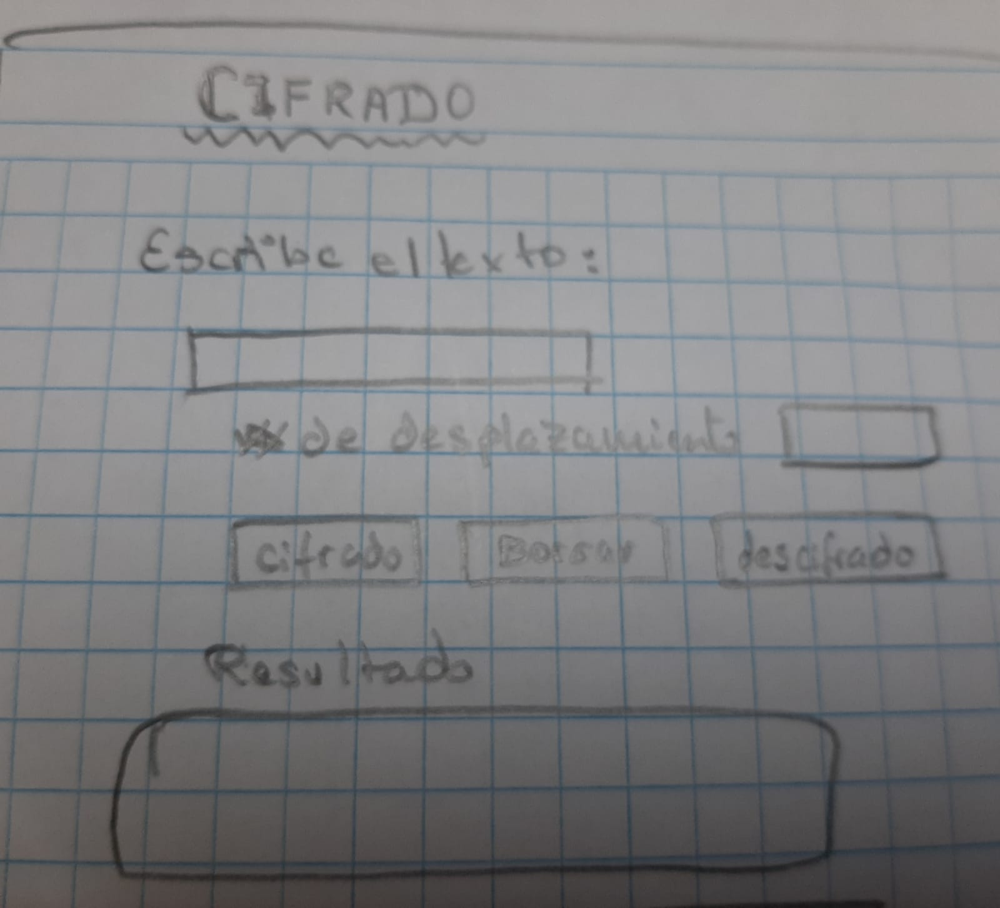
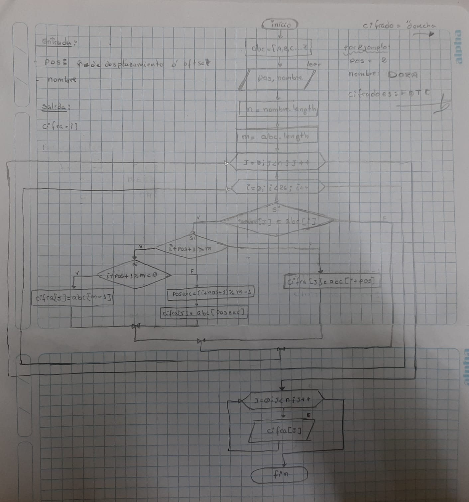
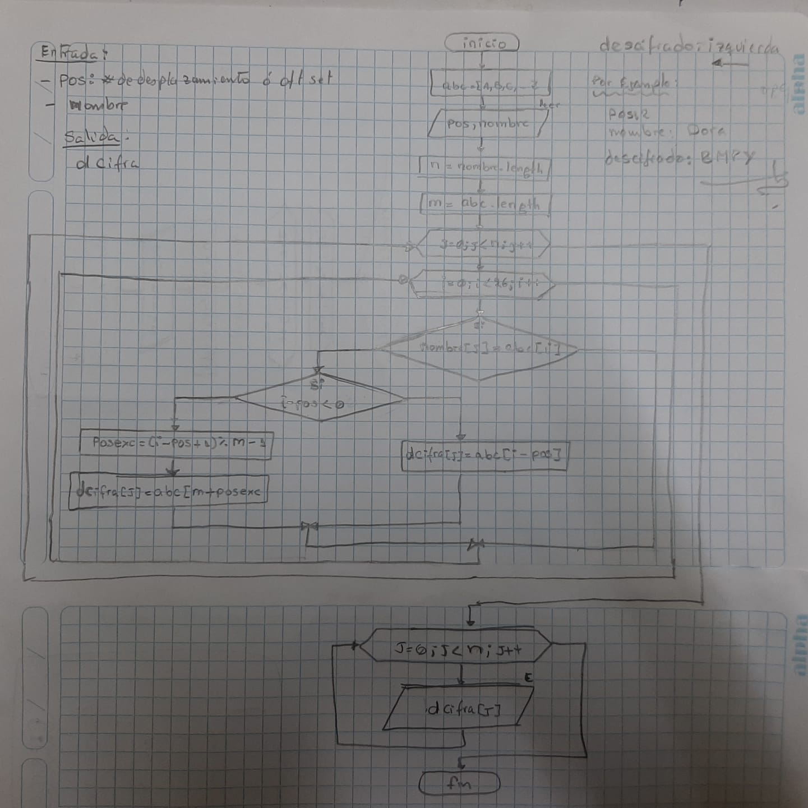
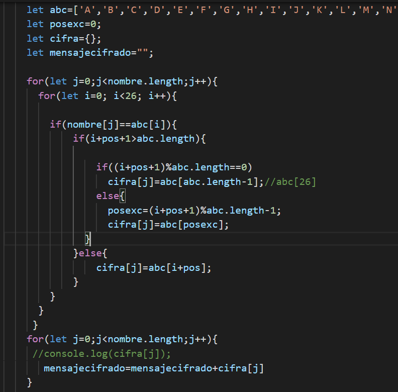
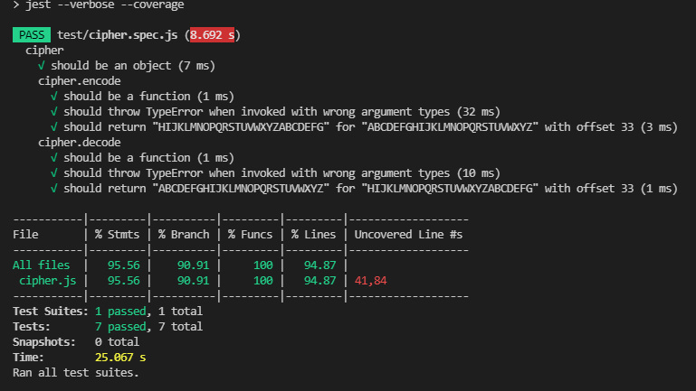
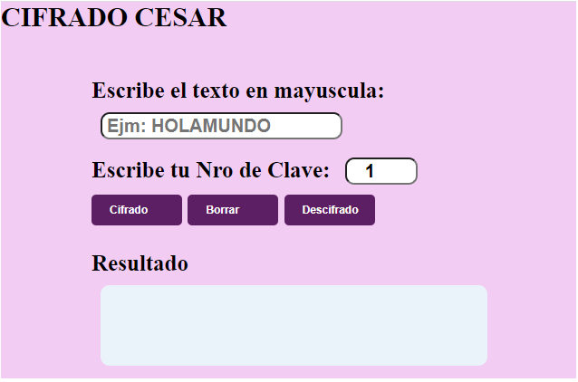

# Cifrado Cesar
## Introducción
El presente programa, te permite codificar tus textos en base al cifrado César. 
El cifrado César es un tipo de cifrado por sustitución en el que una letra en el texto original es reemplazada por otra letra que se encuentra un número fijo de posiciones más adelante en el alfabeto. Por ejemplo, con un desplazamiento de 3, la A sería sustituida por la D (situada 3 lugares a la derecha de la A), la B sería reemplazada por la E, etc. Este método debe su nombre a Julio César, que lo usaba para comunicarse con sus generales.

* quiénes son los principales usuarios de producto?

    Personas que les es dificil crear una constraseña.

* cuáles son los objetivos de estos usuarios en relación con el producto?

    Ayudar al usuario crear buenas constraseñas

* cómo crees que el producto que estás creando les está resolviendo sus problemas?
    Ayudando que puedan crear una constraseña con la palabras conocidas  nombre de familiares, y mas.

### Objetivos de aprendizaje logrados 

En cuanto al HTML y CSS 
- Traté de usar el html lo más que pude, con la etiqueta, form, input, label, en lugar de usar 'div'.
- use css para button de hover y fondo de colores y letras de tamaño ..

En cuanto al DOM
- Puedo decir que manipulo el DOM no al 100% pero estoy  aprendiendo qué utilizar para cada situación, aunque no todo lo he aplicado en este proyecto.

En cuanto a Javascript
- Utilicé condicionales (if), bucles (for), array y funciones.
- Declaré las variables de forma correcta (const & let).
- y tambien use la funcion de length(); cantidad de carecteres

En cuanto a UX (definición del producto):
- Usuarios :  una persona requiere una constraseña con una palabra conocida
- Diseño: hice con colores, letras de tamaño, input, textarea y botones de hover 
- Prototipos y feedbacks: Hice un prototipo, procedí a pedir feedback y me recomendaron, ya esta la funcionalidad del sistema.
 
    * Así quedó mi prototipo listo para pasar al código:
    
    
    

    * Quedando listo para empezar a codificar cifrado:
     

    * Testing: El test del proyecto fue aprobado:

    

    * así que quede el diseño final

    

#### Instrucciones
### Para codificar(encode):
1. Elija en el input las veces que desea que se corra el abecedario.
2. Escriba su texto en mayuscula en el espacio dado para ello.
3. Presione el botón Cifrar.
¡Disfrute su constraseña en mayuscula codificado!.
### Para decodificar(decode):
1. Ponga el **mismo texto codificado**. Ésto es muy importante.
2. Escriba el texto en mayuscula a decodificar.
3. Presione el botón Descifrar.
¡visualizaremos la palabra conocida que genero la constraseña!

Por ejemplo: 
  - la entrada: 
        nombre o mensaje de texto: DORA
        pos o nro de desplazamiento o oftset = 2
  - La salida:
        el resultado de cifrado es:  FQTC
        el resultado de descifrado es: BMPY

Por ejemplo si usáramos un desplazamiento de 3:

* Alfabeto sin cifrar: A B C D E F G H I J K L M N O P Q R S T U V W X Y Z
* Alfabeto cifrado: D E F G H I J K L M N O P Q R S T U V W X Y Z A B C
* Alfabeto descifrado: Z A B C D E F G H I J K L M N O P Q R S T U V W X Y

